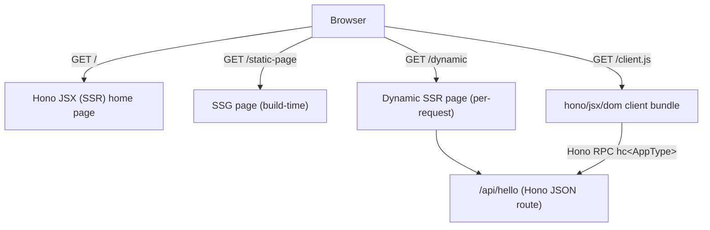

# Hono Full-Stack Hello World

A minimal application demonstrating how Hono's features work together:

- **Hono JSX** for server-side rendering
- **Hono SSG** for static site generation
- **Dynamic server routes** for per-request rendering
- **Hono RPC** for type-safe client-server communication
- **`hono/jsx/dom`** for client-side interactivity
- **Vite** for development, bundling, and external stylesheet processing

No React, Next.js, Astro, or other frontend framework is used.

## Architecture



Routing and rendering split along two axes:

- **When the HTML is produced** — at build time (SSG) vs. per request (SSR).
- **Where the interactivity runs** — server-rendered only vs. a client-side `hono/jsx/dom` component.

## Commands

```bash
pnpm install      # install dependencies
pnpm dev          # start the Vite dev server (port 3000)
pnpm clean        # remove previous build output (rm -rf dist)
pnpm build        # clean, type-check, compile server, bundle client, generate SSG
pnpm start        # run the production server from dist/ (after pnpm build)
```

### What `pnpm build` does

| Step | Script | Command | Output |
|---|---|---|---|
| Remove previous output | `clean` | `rm -rf dist` | (none) |
| Type-check all sources | `typecheck` | `tsc --noEmit` | (none) |
| Compile server + pages | `build:server` | `tsc -p tsconfig.build.json` | `dist/*.js`, `dist/pages/*.js` |
| Bundle client + CSS | `build:client` | `vite build --mode client` | `dist/static/client.js`, `dist/static/styles/*.css` |
| Generate static pages | `build:ssg` | `tsx build.ts` | `dist/static/static-page.html` |

Compiled server code (`tsc` output: `dist/*.js`, `dist/pages/*.js`) lives
under `dist/`, while every static asset (HTML, client JS, CSS) is written to
`dist/static/`. The server compile uses `tsconfig.build.json`, which excludes
`src/client/` from emit; `pnpm typecheck` still checks it with `tsc --noEmit`.

The build is **clean-first**: `toSSG` and `tsc` never delete their previous
output, so a removed page could otherwise linger in `dist/static/` and be served
by the static-first runtime.

## Route classification

- **Build time (SSG):** `/static-page` (generated to `dist/static/static-page.html`, then served as a static file — the server does not re-render it)
- **Server request time:** `/dynamic`, `/api/hello` (both opt out of SSG via `disableSSG()`)
- **Server-rendered + client JavaScript:** `/` (home page)
- **Client-only interactive:** the `hono/jsx/dom` app mounted on `/`

## API reference: `GET /api/hello`

Returns a JSON payload with a server-generated timestamp.

- **Method/Path:** `GET /api/hello`
- **Content-Type:** `application/json`
- **Response:**

```json
{
  "message": "Hello from Hono",
  "timestamp": "2026-08-31T19:58:35.247Z"
}
```

The `timestamp` changes on every request. The route's type is inferred on the
client through Hono RPC — no `fetch()` call with hand-written types.

## External stylesheets (processed by Vite)

Each page's styles live in a separate file under `src/styles/`, and the client
build (`vite build --mode client`) treats each one as a Rollup input, so Vite
minifies and bundles them into `dist/static/styles/`:

```text
src/styles/home.css    -> dist/static/styles/home.css
src/styles/static.css  -> dist/static/styles/static.css
src/styles/dynamic.css -> dist/static/styles/dynamic.css
```

The page components never write inline `<style>`. Instead they inject a
`<link rel="stylesheet">` whose URL is chosen by `src/static-resources.ts`:

- **Development:** `import.meta.env` is defined, so pages link the **source**
  stylesheets (`/src/styles/...`), which Vite serves with HMR and on-the-fly
  injection.
- **Production:** the SSG build runs under `tsx`, where `import.meta.env` is
  undefined, so `isProd` is `true` and pages link the **bundled** assets
  (`/styles/...`), served from `dist/static/` by `serveStatic`.

The same helper resolves the client bundle URL (`jsHref()`) between dev
(`/src/client/index.tsx`) and production (`/client.js`). Keeping the badge
colors per page (green on `/static-page`, amber on `/dynamic`) is only possible
because each page has its own stylesheet — Vite would merge them into one asset
otherwise.

## What to inspect

- **View page source** on `/` to see server-rendered HTML from Hono JSX.
- **Inspect `dist/static/static-page.html`** after build to verify the SSG output contains
  real static HTML.
- **Refresh `/dynamic`** and observe the changing timestamp — this page is
  rendered per-request.
- **Open DevTools** on `/` and observe the client JavaScript loaded from
  `hono/jsx/dom`.
- **Click the counter** — state updates without a page reload.
- **Click "Call API"** — the client calls `/api/hello` via Hono RPC (no raw
  `fetch`) and displays the response.
- **Check `dist/static/styles/`** to confirm Vite processed the per-page stylesheets.

## Project structure

```
src/
├── app.ts                Build-time app: routes, RPC AppType, SSG exclusions
├── index.tsx             Re-exports app for Vite/SSG entry
├── server.ts             Runtime server: static-first serveStatic + mounts app
├── static-resources.ts   Dev/prod asset URL resolution (stylesheetHref, jsHref)
├── pages/
│   ├── Home.tsx          SSR home page + client mount point
│   ├── Static.tsx        SSG page (generated at build time)
│   └── Dynamic.tsx       Dynamic page (rendered per request)
├── styles/
│   ├── home.css          Home page styles (Vite-processed)
│   ├── static.css        Static page styles
│   └── dynamic.css       Dynamic page styles
└── client/
    └── index.tsx         Client bundle: counter + RPC caller
build.ts                  SSG build script (tsx build.ts)
tsconfig.build.json       Server emit config (excludes src/client)
vite.config.ts            Vite: dev server + client build + SSG plugin
```

## Key files

| Feature | File |
|---|---|
| Hono JSX SSR | `src/app.ts`, `src/pages/*.tsx` |
| Hono SSG | `src/pages/Static.tsx`, `build.ts` |
| Dynamic server route | `src/pages/Dynamic.tsx` |
| API route + RPC types | `src/app.ts` (exports `AppType`) |
| Hono RPC client | `src/client/index.tsx` |
| `hono/jsx/dom` | `src/client/index.tsx` |
| External stylesheets | `src/styles/*.css`, `src/static-resources.ts`, `vite.config.ts` |
| Vite integration | `vite.config.ts` |

## Caveats

- **Route handler chaining**: Hono's `hc` type inference requires routes to be
  chained in a single expression (`.get().get().use()`) rather than separate
  `app.get()` calls. Separate calls cause the return type to become `unknown`.

- **`disableSSG()` placement**: The `disableSSG()` middleware must be in the
  route chain (e.g., `app.get('/dynamic', disableSSG(), handler)`) rather than
  applied globally via `app.use()`. Global `app.use()` is not respected by the
  SSG helper.

- **Build-time vs runtime app**: `src/app.ts` is the build-time app (routes
  only) used by `toSSG` and the Vite dev server; it has no static-file
  middleware, so `toSSG` always renders fresh HTML. `src/server.ts` mounts it
  behind a single static-first `serveStatic`, which also rewrites extensionless
  paths to `.html`. Adding an SSG page needs no middleware changes — just a
  route in `app.ts`.

- **`import.meta.env` and the SSG build**: `import.meta.env` exists only inside
  Vite's context. The SSG step runs via `tsx build.ts` over the `tsc`-compiled
  output, where `import.meta.env` is `undefined`. `src/static-resources.ts`
  relies on this to detect production: `const isProd = !import.meta.env`. If
  you change that logic, keep dev/prod asset URLs in sync.

- **Clean build**: `tsc` and `toSSG` do not empty their output directories.
  Because the runtime serves any file under `dist/static/` before routes, a stale
  file can shadow a route (e.g. an old `index.html` for `/`). `pnpm build` runs
  `pnpm clean` first; run it (or `pnpm clean`) after structural changes.